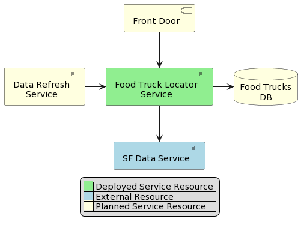

# San Francisco Food Truck Locator Service
This service allows users to find food trucks closest to a specific location within San Francisco.

## Dependency Diagram

[Plant UML file](docs/dependency.diagram.puml)

## Overview
The service is built using Azure Function App. It currently contains one Function "GetFoodTrucks" that exposes an API endpoint to allow users to locate closest food trucks in San Francisco area by supplying their location. The data for food trucks locator is provided by [San Francisco Open Data resource](https://data.sfgov.org/Economy-and-Community/Mobile-Food-Facility-Permit/rqzj-sfat/data). In this first implementation of the service data is exported from the source as a CSV file and stored locally.

Swagger endpoint is available at [/api/swagger/ui]()

Health check endpoint is available at [/api/HealthCheck]()

## Improvements

This is a first MVP version of the service, implemented in given time constraints. We propose the following improvements to make this service better:

- Implement automatic refresh of the source data. This can be achieved by creating a Data Refresh Service (see diagram above) in a form of a Data Factory and an additional Function. The Data Factory will run on time trigger (for example once every night, if source data is updated daily), download fresh CSV file and save the results in a DB. Subsequently Food Truck Locator Service can switch from using locally stored CSV file to a DB as data source.
- After data source is switch to DB, we can remove existing calculations of distances from the code and instead do this using functionality native to MS SQL (geography data type)
- For the first version of this service, we are going to open up the Function App directly to consumers. But when this goes to a public release, we will need to setup an Azure Front Door service in front the Function App. Front Door is the perfect solution to be able to control the flow of incoming traffic, DDOS protection, load balancing etc.
- We should implement logging in the service using Application Insights.
